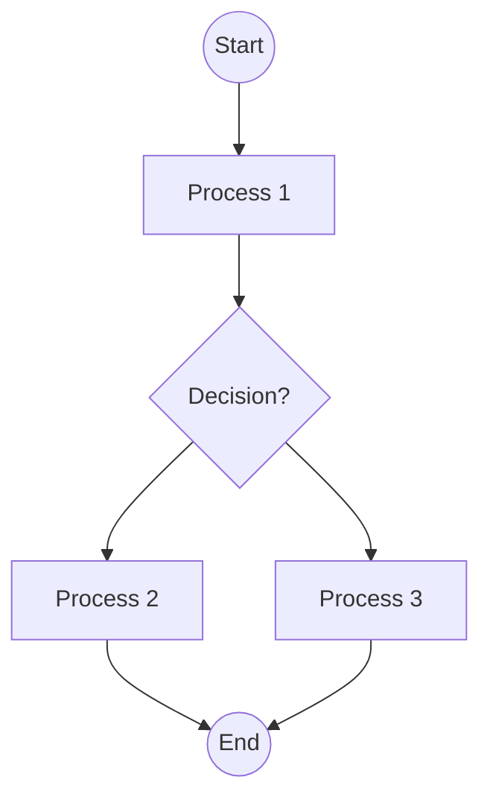

user

## Analyze the flowchart image and convert it to Mermaid syntax.

Follow these requirements strictly:

1. Use proper Mermaid flowchart syntax starting with 'flowchart TD' (top-down) or 'flowchart LR' (left-right)
2. Identify all nodes/boxes and give them appropriate IDs (A, B, C, etc.)
3. Include all decision diamonds with proper syntax using {condition?}
4. Add all connecting arrows and labels using ONLY '-->' (not '-- >' or other variations)
5. Use appropriate node shapes:
   - [Text] for process boxes
   - {Text} for decision diamonds  
   - ((Text)) for start/end circles
   - [Text] for regular rectangles
6. Include all text labels exactly as shown in the image
7. Ensure proper flow direction and connections

IMPORTANT MERMAID SYNTAX RULES:
- Always use '-->' for arrows (never '-- >')
- Node IDs must be followed immediately by node content: A[Process] or B{Decision?}
- Decision nodes use curly braces: {Is condition met?}
- Start/End nodes use double parentheses: ((Start)) or ((End))
- Process nodes use square brackets: [Do something]
- No spaces in arrow syntax: A --> B (not A -- > B)

EXAMPLE:


Provide only the Mermaid code without any additional explanation.assistant

```mermaid
flowchart TD
    A((Start: Vehicle is reported stolen)) --> B[Report of stolen vehicle]
    B --> C[Activate LoJack system]
    C --> D{Local police equipped with tracking equipment?}
    D --> E[Track vehicle's position]
    E --> F{Signal available for tracking by police}
    F --> G[User in LoJack covered area?]
    G --> H[Consider purchasing LoJack]
    H --> I[Check LoJack coverage]
    I --> J{List of counties with LoJack coverage}
    J --> K[End: LoJack may not be beneficial]
    K --> L[Consider purchasing LoJack]
    L --> M{List of authorized LoJack dealers}
    M --> N[Contact LoJack for fleet pricing]
    N --> O[Information about fleet pricing]
    O --> P{Locate authorized LoJack dealers}
    P --> Q[End: LoJack system obtained on LoJack's website]
    Q --> R[List of authorized LoJack dealers]
    R --> S[Call LoJack's customer service for purchase]
    S --> T{Purchase directly from LoJack?}
    T --> U[Purchase from authorized dealer]
    U --> V{Arrangement for direct purchase and installation}
    V --> W[End: Unable to track vehicle]
    W --> X[Signal available for tracking by police]
    X --> Y[Track vehicle's position]
    Y --> Z[End: Unable to track vehicle]
    Z --> AA[Signal available for tracking by police]
    AA --> BB[Track vehicle's position]
    BB --> CC[End: Unable to track vehicle]
    CC --> DD[Signal available for tracking by police]
    DD --> EE[Track vehicle's position]
    EE --> FF[End: Unable to track vehicle]
    FF --> GG[Signal available for tracking by police]
    GG --> HH[Track vehicle's position]
    HH --> II[End: Unable to track vehicle]
    II --> JJ[Signal available for tracking by police]
    JJ --> KK[Track vehicle's position]
    KK --> LL[End: Unable to track vehicle]
    LL --> MM[Signal available for tracking by police]
    MM --> NN[Track vehicle's position]
    NN --> OO[End: Unable to track vehicle]
    OO --> PP[Signal available for tracking by police]
    PP --> QQ[Track vehicle's position]
    QQ --> RR[End: Unable to track vehicle]
    RR --> SS[Signal available for tracking by police]
    SS --> TT[Track vehicle's position]
    TT --> UU[End: Unable to track vehicle]
    UU --> VV[Signal available for tracking by police]
    VV --> WW[Track vehicle's position]
    WW --> XX[End: Unable to track vehicle]
    XX --> YY[Signal available for tracking by police]
    YY