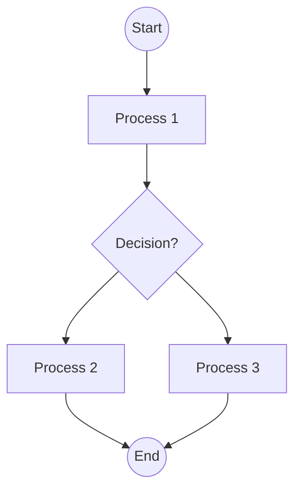

user

## Analyze the flowchart image and convert it to Mermaid syntax.

Follow these requirements strictly:

1. Use proper Mermaid flowchart syntax starting with 'flowchart TD' (top-down) or 'flowchart LR' (left-right)
2. Identify all nodes/boxes and give them appropriate IDs (A, B, C, etc.)
3. Include all decision diamonds with proper syntax using {condition?}
4. Add all connecting arrows and labels using ONLY '-->' (not '-- >' or other variations)
5. Use appropriate node shapes:
   - [Text] for process boxes
   - {Text} for decision diamonds  
   - ((Text)) for start/end circles
   - [Text] for regular rectangles
6. Include all text labels exactly as shown in the image
7. Ensure proper flow direction and connections

IMPORTANT MERMAID SYNTAX RULES:
- Always use '-->' for arrows (never '-- >')
- Node IDs must be followed immediately by node content: A[Process] or B{Decision?}
- Decision nodes use curly braces: {Is condition met?}
- Start/End nodes use double parentheses: ((Start)) or ((End))
- Process nodes use square brackets: [Do something]
- No spaces in arrow syntax: A --> B (not A -- > B)

EXAMPLE:


Provide only the Mermaid code without any additional explanation.assistant

```mermaid
flowchart TD
    A((Start)) --> B[Open Developer Tools]
    B --> C{Press 'Ctrl+Shift+l' or 'Command+Shift+l'}
    C --> D[Inspect the Image]
    D --> E{Inspect' Option Available?}
    E --> F[Select 'Inspect']
    F --> G[Navigate Through Code]
    G --> H{Correct Image Section Found?}
    H --> I[Link Leads to Desired Image?]
    I --> J[Right-click and Copy Link Address]
    J --> K[Image URL Copied to Clipboard]
    K --> L{Image URL is Correct}
    L --> M[Image Loads in New Tab?]
    M --> N{Image Loads in New Tab?}
    N --> O[Image URL is Correct]
    O --> P[URL is Not Correct Image Address]
    P --> Q[Hover Over Link]
    Q --> R{Link Leads to Desired Image?}
    R --> S[Right-click and Copy Link Address]
    S --> T[Image URL Copied to Clipboard]
    T --> U{Image URL is Correct}
    U --> V[Image Loads in New Tab?]
    V --> W[Image URL is Correct]
    W --> X[URL is Not Correct Image Address]
    X --> Y[Hover Over Link]
    Y --> Z[Link Leads to Desired Image?]
    Z --> AA[Right-click and Copy Link Address]
    AA --> BB[Image URL Copied to Clipboard]
    BB --> CC{Image URL is Correct}
    CC --> DD[Image Loads in New Tab?]
    DD --> EE[Image URL is Correct]
    EE --> FF[URL is Not Correct Image Address]
    FF --> GG[Hover Over Link]
    GG --> HH[Link Leads to Desired Image?]
    HH --> II[Right-click and Copy Link Address]
    II --> JJ[Image URL Copied to Clipboard]
    JJ --> KK{Image URL is Correct}
    KK --> LL[Image Loads in New Tab?]
    LL --> MM[Image URL is Correct]
    MM --> NN[URL is Not Correct Image Address]
    NN --> OO[Hover Over Link]
    OO --> PP[Link Leads to Desired Image?]
    PP --> QQ[Right-click and Copy Link Address]
    QQ --> RR[Image URL Copied to Clipboard]
    RR --> SS{Image URL is Correct}
    SS --> TT[Image Loads in New Tab?]
    TT --> UU[Image URL is Correct]
    UU --> VV[URL is Not Correct Image Address]
    VV --> WW[Hover Over Link]
    WW --> XX[Link Leads to Desired Image?]
    XX --> YY[Right-click and Copy Link Address]
    YY --> ZZ[Image URL Copied to Clipboard]
    ZZ --> AAA{Image URL is Correct}
    AAA --> BBB[