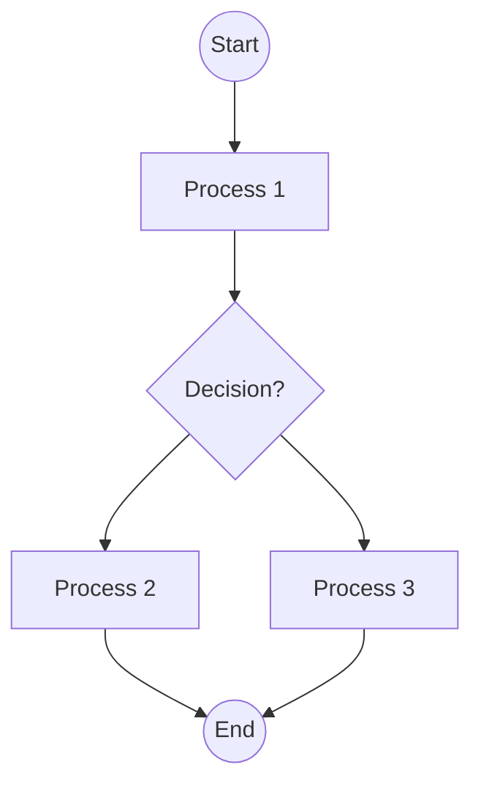

user

## Analyze the flowchart image and convert it to Mermaid syntax.

Follow these requirements strictly:

1. Use proper Mermaid flowchart syntax starting with 'flowchart TD' (top-down) or 'flowchart LR' (left-right)
2. Identify all nodes/boxes and give them appropriate IDs (A, B, C, etc.)
3. Include all decision diamonds with proper syntax using {condition?}
4. Add all connecting arrows and labels using ONLY '-->' (not '-- >' or other variations)
5. Use appropriate node shapes:
   - [Text] for process boxes
   - {Text} for decision diamonds  
   - ((Text)) for start/end circles
   - [Text] for regular rectangles
6. Include all text labels exactly as shown in the image
7. Ensure proper flow direction and connections

IMPORTANT MERMAID SYNTAX RULES:
- Always use '-->' for arrows (never '-- >')
- Node IDs must be followed immediately by node content: A[Process] or B{Decision?}
- Decision nodes use curly braces: {Is condition met?}
- Start/End nodes use double parentheses: ((Start)) or ((End))
- Process nodes use square brackets: [Do something]
- No spaces in arrow syntax: A --> B (not A -- > B)

EXAMPLE:


Provide only the Mermaid code without any additional explanation.assistant

```mermaid
flowchart TD
    A((Start)) --> B[Initialize the gaming team composition system]
    B --> C[Recruit Snipers for the team]
    C --> D[Assign Snipers the task of sniping from a distance]
    D --> E[Recruit Heavies for the team]
    E --> F[Arm Heavies with heavy weapons]
    F --> G[Position Heavies in the battlefield]
    G --> H{Snipers/Vehicle Fighters covering Heavies?}
    H --> I[Adjust positions for Heavies' cover]
    I --> J{Heavies engage in battle}
    J --> K[Recruit Scouts/Spies for the team]
    K --> L[Equip Scouts/Spies with light weapons]
    L --> M{Assign tasks to Scouts/Spies}
    M --> N[Recruit Vehicle Fighters for the team]
    N --> O[Train Vehicle Fighters in driving vehicles]
    O --> P{Vehicle Fighter proficient}
    P --> Q{Vehicle Fighters transport & engage enemies}
    Q --> R{Divide team into ambush squad & mobile unit}
    R --> S{Signal ambush squad to open fire}
    S --> T{Continue patrolling}
    T --> U{Well-structured team & effective tactics}
    U --> V{Signal ambush squad to open fire}
    V --> W{Assign tasks to Scouts/Spies}
    W --> X{Recruit Vehicle Fighters for the team}
    X --> Y{Train Vehicle Fighters in driving vehicles}
    Y --> Z{Provide additional trainin}
    Z --> ((End))
```