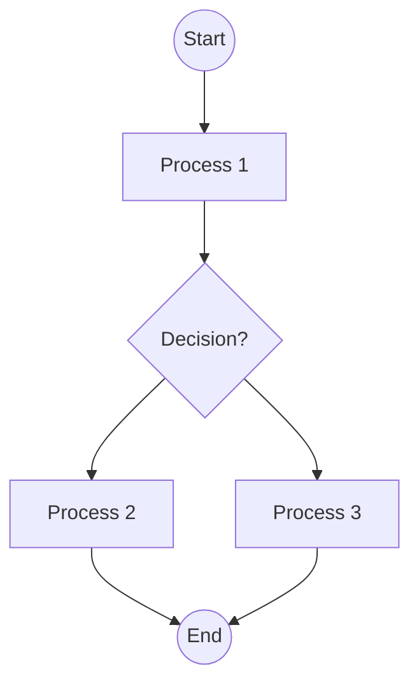

user

## Analyze the flowchart image and convert it to Mermaid syntax.

Follow these requirements strictly:

1. Use proper Mermaid flowchart syntax starting with 'flowchart TD' (top-down) or 'flowchart LR' (left-right)
2. Identify all nodes/boxes and give them appropriate IDs (A, B, C, etc.)
3. Include all decision diamonds with proper syntax using {condition?}
4. Add all connecting arrows and labels using ONLY '-->' (not '-- >' or other variations)
5. Use appropriate node shapes:
   - [Text] for process boxes
   - {Text} for decision diamonds  
   - ((Text)) for start/end circles
   - [Text] for regular rectangles
6. Include all text labels exactly as shown in the image
7. Ensure proper flow direction and connections

IMPORTANT MERMAID SYNTAX RULES:
- Always use '-->' for arrows (never '-- >')
- Node IDs must be followed immediately by node content: A[Process] or B{Decision?}
- Decision nodes use curly braces: {Is condition met?}
- Start/End nodes use double parentheses: ((Start)) or ((End))
- Process nodes use square brackets: [Do something]
- No spaces in arrow syntax: A --> B (not A -- > B)

EXAMPLE:


Provide only the Mermaid code without any additional explanation.assistant

```mermaid
flowchart TD
    A((Start)) --> B[Start Custom Fabric Paint Creation]
    B --> C[Gather Materials]
    C --> D{Is the fabric light-colored}
    D --> E[Use Transparent Gloss Medium]
    D --> F{Use Opaque Gloss/Matte Medium}
    F --> G[Text Paint on Fabric]
    G --> H{Does paint soak through?}
    H --> I[Add More Acrylic Paint]
    I --> J{Does paint dry stiff?}
    J --> K[Add More Acrylic Medium]
    K --> L{Let Paint Dry Completely}
    L --> M[Iron Painted Fabric to Heat-Set]
    M --> N[Wash Heat-Set Fabric]
    N --> O{Is paint too thick?}
    O --> P[Add More Acrylic Medium and Retest]
    P --> Q[Custom Fabric Paint Ready]
    Q --> R((End Custom Fabric Paint Creation))
    E --> G
    G --> H
    H --> I
    I --> J
    J --> K
    K --> L
    L --> M
    M --> N
    N --> O
    O --> P
    P --> Q
    Q --> R
    H --> H
    I --> I
    J --> J
    K --> K
    L --> L
    M --> M
    N --> N
    O --> O
    P --> P
    Q --> Q
    R --> R
    F --> F
    G --> G
    H --> H
    I --> I
    J --> J
    K --> K
    L --> L
    M --> M
    N --> N
    O --> O
    P --> P
    Q --> Q
    R --> R
    E --> E
    F --> F
    G --> G
    H --> H
    I --> I
    J --> J
    K --> K
    L --> L
    M --> M
    N --> N
    O --> O
    P --> P
    Q --> Q
    R --> R
    D --> D
    E --> E
    F --> F
    G --> G
    H --> H
    I --> I
    J --> J
    K --> K
    L --> L
    M --> M
    N --> N
    O --> O
    P --> P
    Q --> Q
    R --> R
    C --> C
    D --> D
    E --> E
    F --> F
    G --> G
    H --> H
    I --> I
    J --> J
    K --> K
    L --> L
    M --> M
    N --> N
    O --> O
    P --> P
    Q --> Q
