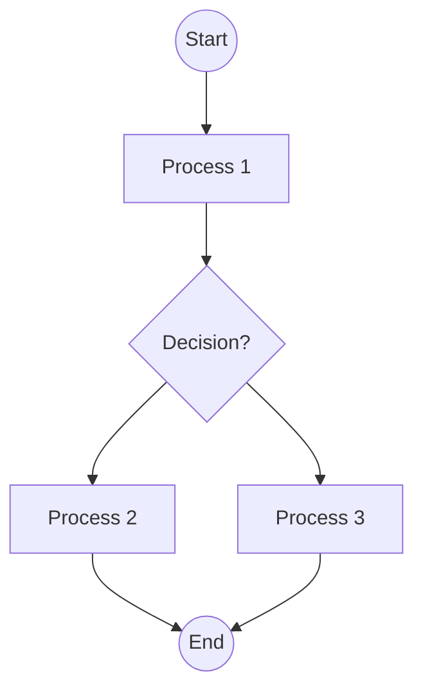

user

## Analyze the flowchart image and convert it to Mermaid syntax.

Follow these requirements strictly:

1. Use proper Mermaid flowchart syntax starting with 'flowchart TD' (top-down) or 'flowchart LR' (left-right)
2. Identify all nodes/boxes and give them appropriate IDs (A, B, C, etc.)
3. Include all decision diamonds with proper syntax using {condition?}
4. Add all connecting arrows and labels using ONLY '-->' (not '-- >' or other variations)
5. Use appropriate node shapes:
   - [Text] for process boxes
   - {Text} for decision diamonds  
   - ((Text)) for start/end circles
   - [Text] for regular rectangles
6. Include all text labels exactly as shown in the image
7. Ensure proper flow direction and connections

IMPORTANT MERMAID SYNTAX RULES:
- Always use '-->' for arrows (never '-- >')
- Node IDs must be followed immediately by node content: A[Process] or B{Decision?}
- Decision nodes use curly braces: {Is condition met?}
- Start/End nodes use double parentheses: ((Start)) or ((End))
- Process nodes use square brackets: [Do something]
- No spaces in arrow syntax: A --> B (not A -- > B)

EXAMPLE:


Provide only the Mermaid code without any additional explanation.assistant

```mermaid
flowchart TD
    A((Start)) --> B[Patient's medical history, age, and other relevant factors]
    B --> C{Evaluate patient's condition for eligibility}
    C --> D[Register for tonometry]
    D --> E{Recommend tonometry?}
    E --> F[Patient agrees to tonometry?]
    F --> G{Proceed to Surgery Preparation}
    G --> H[End Tonometry Evaluation Process]
    H --> I{Begin Alternative Treatment Evaluation Process}
    I --> J{Discuss removal of tonal stoma}
    J --> K{Can stones be removed in office?}
    K --> L{Consider Antibiotics or Laser Treatment}
    L --> M{Begin Antibiotics Evaluation Process}
    M --> N{End Stone Removal Process}
    N --> O{Evaluate antibiotics suitability}
    O --> P{Use antibiotics for treatment}
    P --> Q{Consider Laser Treatment}
    Q --> R{Begin Laser Resurfacing Evaluation Process}
    R --> S{Consider Antibiotics}
    S --> T{Administer Antibiotic}
    T --> U{Antibiotics effective?}
    U --> V{Tonil stones treated?}
    V --> W{End Antibiotics Treatment Process}
    W --> X{Consider Laser Treatment}
    X --> Y{Continue monitoring condition}
    Y --> Z{Evaluate laser resurfacing appropriateness}
    Z --> AA{Suitable for laser resurfacing?}
    AA --> BB{Perform Laser Resurfacing Procedure}
    BB --> CC{End Laser Resurfacing Evaluation Process}
    CC --> DD{Procedure successful?}
    DD --> EE{Continue monitoring condition}
    EE --> FF{End Laser Resurfacing Treatment Process}
    FF --> GG{Manage Complications}
    GG --> HH{Continue monitoring condition}
    HH --> ((End))
```